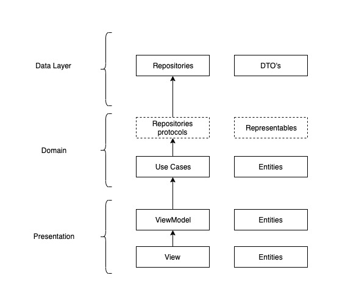
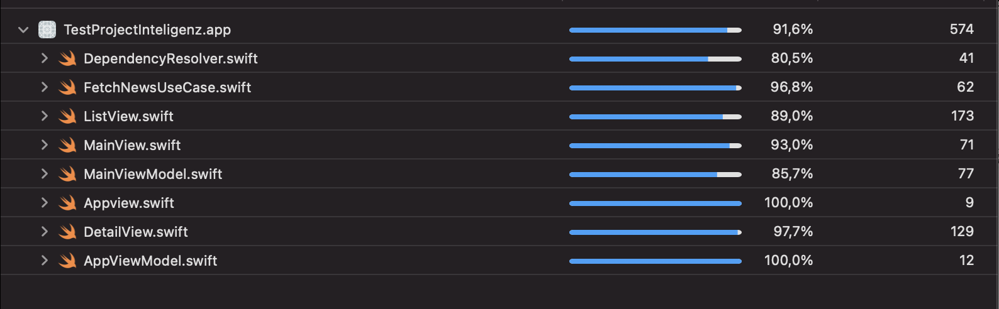

# Test project

## Architecture

This project is built using SwiftUI and Combine. These frameworks are design to work on reactive patterns so the architecture chosen is MVVM.

The separation of responsabilities between layers is represented in the the following diagram.



- Repositories: Are reponsible to obtain the data from as different sources as needed, in this project from network request to aircell test API. They implement the definitions from domain layer repositories.
- DTO's: Data objects. Theses objects are not available outside the data layer. They implement the representables from the domain layer.
- Repositories protocols: Protocols that represent the data domain needs.
- Representables: Protocols that represent the objects with the data that domain needs.
Theses objects can be used in presentation layer.
- Use cases: Contain the bussiness logic of the app.
- Entities: These objects are created in case the representable needs to be extended.
- ViewModel: Responsible for handling the states of the views. They can work with representables or entities.
- View: Show information to the user and captures user interaction.

## Modularization
Modules make easier to keep control of responsabilities. Only public code is available outside the module.

- Domain: Contains the definitions of repositories and objects that represent the needs of domain from data.

- Services: This module is the data layer. Implements the protocols defined in domain. This strategy allows to be able to replace the data layer without affecting the domain layer.

## Dependency Injection

The Dependency injection system uses the singleton pattern.

### Registering object:
An object is registerd accessing the shared instance.
```
private let services = Services()
...
DependencyResolver.shared.register(type: RepositoriesProvider.self) {
            return self.services
        }
```

### Injecting dependencies
For injection a property wrapper is used. This property wrapper access the shared instance and resolves the object based on the type of the property. 
```
@Inject private var repositoryProvider: RepositoriesProvider
```


## Libraries
- [ServicesLibrary](https://github.com/joseidev/servicesLibrary): This library is a work in progress that I'm working on to use in my personal projects. It handles network requests.

- [Kingfisher](https://github.com/onevcat/Kingfisher): This library handles the load of remote images.

- [SnapShot-Testing](https://github.com/pointfreeco/swift-snapshot-testing): Library for UI testing. Takes a screnshot of a state of the view and uses as reference for following tests.

## Persistance
To allow offline acceess to the last requested news the app is using Core Data.
With each network request the stored data is udpated. If is not possible to obtain remote data the stored data is presented to the user.


## Testing

- Unit tests: The project contains unit tests for view model and use case. Mocks are injected for dependencies allowing to test the objects isolated.

- UI Testing: There are a couple of tests. For more exhaustive testing more time would be requiered.
The tests have to be run with the same simulator and ios version than the one used to take the reference screenshots.  
iPhone 11 - iOS 15.2

### Coverage


